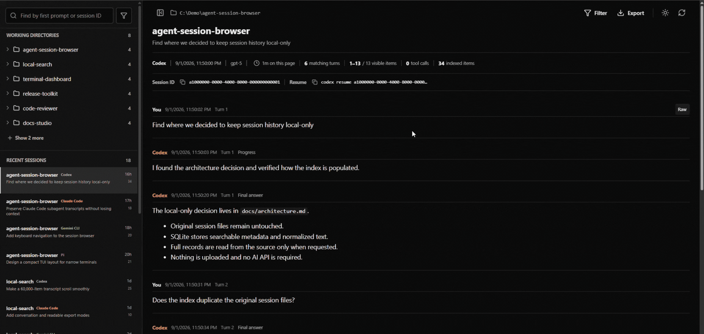
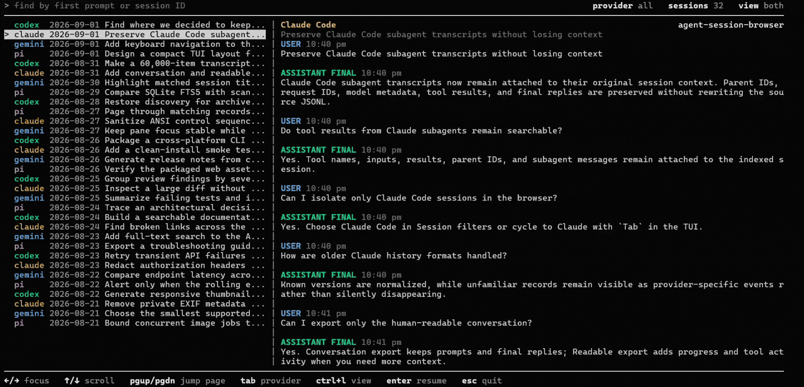
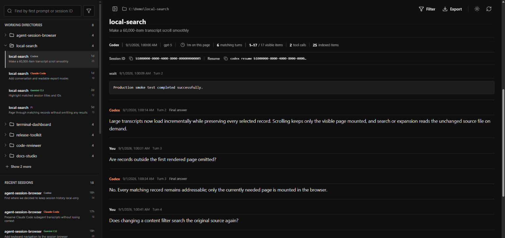
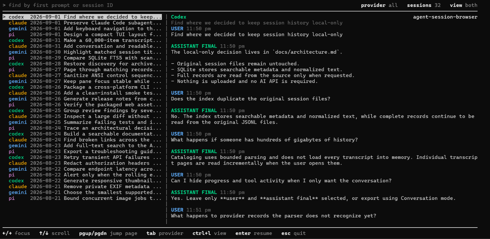

# Agent Session Browser

A local-first web interface, terminal UI, and CLI for browsing, reading, filtering, exporting, and resuming coding-agent sessions.

Agent Session Browser turns the history already stored by **Codex CLI**, **Claude Code**, **Gemini CLI**, and **Pi** into readable conversations without modifying the original session files.

## See it in action

### Web interface



### Terminal interface



<p align="center"><sub>Demo data is synthetic. Your session history stays on your machine.</sub></p>

## Why this exists

Terminal coding agents preserve useful context: prompts, final answers, reasoning, plans, tool calls, command output, file changes, hooks, warnings, errors, token usage, and provider-specific events. But that history is scattered across provider folders and stored as JSON, JSONL, or other machine-oriented records.

That makes three everyday tasks harder than they should be:

1. **Reading an old session.** Raw history files are difficult to navigate as a coherent conversation.
2. **Finding the relevant session.** You may remember the project or opening prompt, but not which agent or session contained the work.
3. **Choosing the right session to resume.** Titles and first prompts are often too similar. Seeing the actual transcript makes it much easier to resume the correct session from the terminal.

Agent Session Browser provides one local place to browse histories from all four agents, narrow sessions by project and date, inspect their contents in a human-readable form, and resume the right session with its native provider CLI.

## Features

### Find the right session

- Browse Codex CLI, Claude Code, Gemini CLI, and Pi sessions together or one provider at a time.
- Find sessions by their first user prompt or session ID.
- Group sessions by working directory and quickly revisit recent sessions.
- Filter by provider, working directory, date range, active or archived state, and parse status.
- Open a session directly from its internal ID, provider-native ID, or cataloged source path.
- Refresh manually or let the local catalog update as supported history folders change.

### Read sessions as conversations

- Start with a clean conversation containing user messages and provider-confirmed final answers.
- Reveal progress and incomplete messages, instructions and context, reasoning, plans, tool calls and output, file changes, hooks, lifecycle events, usage updates, warnings, errors, and provider-specific records.
- Filter the selected transcript by exact tool name and individual event category.
- Read message content as GitHub Flavored Markdown instead of escaped payloads.
- See the provider, workspace, date, model, archive state, and visible item and tool-call counts when available.
- Inspect the original raw source record for any transcript item.
- Expand shortened messages inline from the unchanged source file.
- Move through large filtered transcripts with explicit page controls.
- Use light or dark mode and collapse the session sidebar when more reading space is needed.

### Resume and export

- Copy a session ID or provider-native resume command from the web interface.
- Preview the selected conversation in the TUI before resuming a similarly named session.
- Resume from the TUI in the session's recorded working directory.
- Export sessions as portable Markdown or self-contained offline HTML.
- Open a printable transcript for printing or saving as PDF.
- Choose conversation, readable, or full trace output for non-interactive CLI exports.

### Local-first by design

- Discovers histories from their standard user-level locations.
- Leaves provider history files unchanged.
- Stores a lightweight local SQLite catalog of paths and session summaries rather than a second copy of every transcript.
- Runs without an AI API, provider login, cloud account, telemetry, or session upload.
- Binds the web interface to `127.0.0.1` only.

## Quick start

### Requirements

- Node.js **22.13 or newer**
- npm
- At least one supported coding agent with local session history
- A modern browser for the web interface

The matching provider CLI is required only when resuming a session. Browsing, reading, filtering, and exporting existing history do not require provider authentication.

### Run without installing

Open the terminal interface from any directory:

```sh
npx agent-session-browser
```

Start the web interface and open it in your default browser:

```sh
npx agent-session-browser web
```

### Install the short command

```sh
npm install --global agent-session-browser
```

The bare command opens the TUI. Add `web` for the browser interface:

```sh
asb
asb web
```

Use `asb web --no-open` to print the local URL without opening a browser, or `asb web --port 4180` to choose another port.

### Run from source

```sh
git clone https://github.com/gautamgpt1/agent-session-browser.git
cd agent-session-browser
npm ci
npm run dev
```

Open [http://127.0.0.1:4173](http://127.0.0.1:4173).

Start the source TUI with:

```sh
npm run tui
```

Run this source command from the cloned repository. The application still discovers user-level agent histories rather than limiting results to that repository's working directory.

For a production web build:

```sh
npm run build
npm start
```

## Web interface



Use the web interface for the most detailed session inspection:

1. Find a session by its first prompt or ID, or narrow the catalog by provider, working directory, date, archive state, or parse status.
2. Select a session from the recent list or its working-directory group.
3. Read the default user-and-final-answer conversation.
4. Open **Filter** to include reasoning, plans, tools, hooks, file changes, lifecycle events, errors, raw provider events, or any other recorded category.
5. Select exact tool names when you want only their calls and output.
6. Inspect a raw record, copy the native resume command, or export the transcript.

The finder also accepts an exact internal session ID, provider-native session ID, or known source-file path. Press **Enter** to open an exact match directly.

## Terminal UI



The TUI is designed for the moment you are already in a terminal and need to answer: **Which session should I resume?**

It places the session list and selected conversation side by side. You can browse every supported provider, restrict the list to one provider, search session candidates, search inside the selected conversation, and switch between session-only, transcript-only, and split views. The transcript pane focuses on user prompts and provider-confirmed final answers so you can identify the session before resuming it.

### TUI controls

| Key | Action |
| --- | --- |
| `Left` / `Right` | Focus the session list or transcript pane |
| `Up` / `Down` | Move through sessions or scroll the focused transcript one wrapped line |
| `Page Up` / `Page Down` | Jump one visible page in the focused pane |
| Type / `Backspace` | Search the focused session list or transcript |
| `Tab` | Cycle through all providers, Codex, Claude Code, Gemini CLI, and Pi |
| `Ctrl+L` | Cycle between split, session-only, and transcript-only views |
| `Ctrl+O` | Expand the current shortened message when the inline hint is visible |
| `Ctrl+R` | Show the provider-native resume command |
| `Enter` | Resume the selected session with its provider CLI |
| `Esc` / `Ctrl+C` | Exit |

When resuming, the TUI launches the installed provider CLI in the working directory recorded by the session. If that directory no longer exists, it leaves the session untouched and explains why it cannot resume it directly.

## Supported agents

| Agent | Default history location | Native resume command |
| --- | --- | --- |
| Codex CLI | `~/.codex/sessions` and `~/.codex/archived_sessions` | `codex resume <id>` |
| Claude Code | `~/.claude/projects` | `claude --resume <id>` |
| Gemini CLI | `~/.gemini/tmp/<project>/chats` | `gemini --resume <id>` |
| Pi | `~/.pi/agent/sessions` | `pi --session <id>` |

Provider-specific coverage includes:

- **Codex CLI:** active and archived sessions, messages, reasoning, plans, tools, file changes, hooks, lifecycle events, usage, warnings, and additional provider records.
- **Claude Code:** project sessions and distinct subagent transcripts, including tools, results, context, metadata, and provider events.
- **Gemini CLI:** project-path recovery, current chat histories, and supported legacy session structures.
- **Pi:** session branches, compactions, summaries, model changes, usage, tool calls, and tool results.

Provider history formats change over time. Recognized content is normalized for readable display, while unknown records remain available as provider events and raw JSON rather than being silently dropped.

## CLI usage

The installed `asb` command opens the TUI by default and accepts session discovery, resume, and export options:

```sh
# Find sessions from all providers
asb --query "authentication failure"

# Restrict the session list to one provider
asb --provider claude --query "database migration"

# Print the native resume command for an exact session ID or source path
asb --session <id-or-path> --print-resume

# Export without opening the interactive TUI
asb --session <id-or-path> --export html --mode readable
asb --session <id-or-path> --export md --mode conversation
```

When running from source, replace `asb` with `npm run tui -- --`.

### Options

```text
-q, --query <text>       Find sessions by first prompt or ID
--provider <provider>    Restrict results to codex, claude, gemini, or pi
--session <id-or-path>   Resolve one session by ID or cataloged source path
--print-resume           Print the native resume command
--export <md|html>       Export without opening the interactive TUI
--mode <mode>            conversation, readable, or trace
-h, --help               Show command help
```

When stdout is redirected, the command prints tab-separated session results instead of terminal control sequences. Each row contains the internal session ID, provider, timestamp, working directory, and first user message. Use `npm run --silent tui -- ...` when piping through npm so npm does not add its script banner.

## Transcript filters and export modes

The web interface begins with the conversation and lets you add or remove exact categories for the selected session. Depending on what the provider recorded, these can include:

- assistant progress, incomplete, and unclassified messages
- developer instructions, turn context, and session metadata
- reasoning and plans
- command execution, MCP tools, dynamic tools, subagents, web search, image tools, and other work items
- tool output and streaming output
- file changes and patches
- task, turn, thread, process, compaction, and hook lifecycle events
- token usage, rate limits, and tool-status updates
- review, approval, environment, app-server, and realtime events
- warnings, errors, attachments, snapshots, and other provider-specific records

Non-interactive CLI exports offer three levels of detail:

| Mode | Includes |
| --- | --- |
| **Conversation** | User messages and provider-confirmed final answers |
| **Readable** | Conversation content plus assistant progress, reasoning, and tool activity |
| **Trace** | Every normalized event plus the original raw source records |

## Exports

| Format | Best for |
| --- | --- |
| **Offline HTML** | A styled, self-contained transcript that opens without Agent Session Browser |
| **Markdown** | Notes, source control, audits, and further editing |
| **Print / PDF** | Printing or saving the complete readable transcript from the browser |

The web interface exports its readable view as HTML or Markdown and can open the same view in a printable page. The CLI can export conversation, readable, or trace modes.

Exports can contain prompts, source code, command output, file paths, environment details, credentials, or other secrets captured in the original agent session. Review exported files before sharing them.

## Configuration

Standard history locations are detected automatically. Use environment variables when an agent home is on another drive, inside WSL, or mounted from another machine.

| Variable | Purpose |
| --- | --- |
| `AGENT_SESSION_BROWSER_CODEX_HOME` | Codex home containing `sessions` and `archived_sessions` |
| `AGENT_SESSION_BROWSER_CLAUDE_HOME` | Claude home containing `projects` |
| `AGENT_SESSION_BROWSER_GEMINI_HOME` | Gemini home containing `tmp` |
| `AGENT_SESSION_BROWSER_PI_HOME` | Pi home containing `agent/sessions` |
| `AGENT_SESSION_BROWSER_DATA_DIR` | Local SQLite catalog and CLI export directory |
| `AGENT_SESSION_BROWSER_PORT` | Local web port; defaults to `4173` |
| `AGENT_SESSION_BROWSER_DISABLE_WATCHER=1` | Disable automatic watching of supported history folders |

The standard `CODEX_HOME` and `CLAUDE_CONFIG_DIR` variables are also respected.

### Examples

Linux, macOS, or WSL:

```sh
AGENT_SESSION_BROWSER_CODEX_HOME=/mnt/c/Users/alice/.codex npm run dev
```

Windows PowerShell:

```powershell
$env:AGENT_SESSION_BROWSER_CLAUDE_HOME = 'D:\agent-data\claude'
npm run dev
```

### Local data directory

| Platform | Default location |
| --- | --- |
| Windows | `%LOCALAPPDATA%\Agent Session Browser` |
| macOS | `~/Library/Application Support/Agent Session Browser` |
| Linux / WSL | `${XDG_DATA_HOME:-~/.local/share}/agent-session-browser` |

For histories stored on another machine, mount or synchronize the relevant agent home locally and point the matching environment variable to it.

## How it works

1. Agent Session Browser discovers supported history files and builds a lightweight SQLite catalog containing their paths and small session summaries.
2. The session finder uses cataloged project names, first prompts, and IDs; opening a transcript reads its original source file.
3. Each provider's records are normalized into one display model while preserving access to provider-specific events and raw source records.
4. Large filtered transcripts are presented in explicit pages, and shortened messages can be expanded inline from their original source.
5. Exports are created only when requested, and resume actions hand the selected native session ID to the matching provider CLI.

You do not need to understand the providers' JSON or JSONL formats to use the application.

## Privacy and security

Agent Session Browser is a single-user local application.

- Provider history files are read without being modified, moved, or deleted.
- Transcript bodies and tool output are not copied into the SQLite catalog; the catalog can contain local paths and short session summaries.
- The web server binds only to `127.0.0.1` and rejects non-loopback host headers and cross-origin browser requests.
- No telemetry, AI API call, session upload, or other external network request is implemented.
- A provider CLI is launched only when you explicitly resume a selected session.

The local web server has no authentication and is not intended to be exposed through port forwarding, a reverse proxy, a shared host, or a public network interface. Anyone who can read your operating-system account can generally read the original agent histories and any exports you create.

Report security issues privately through the repository's **Security** tab. Do not attach real session files, credentials, or private trace data to a public issue. See [SECURITY.md](SECURITY.md) for the full policy.

## Development

Install dependencies and run the main checks:

```sh
npm ci
npm run build
npm test
npm run test:production
npm run test:package
```

Install Chromium once before running browser tests:

```sh
npx playwright install chromium
npm run test:e2e
```

Run the complete build, unit, production, browser, and package test sequence with:

```sh
npm run check
```

Run `npm run clean` to remove generated build, coverage, Playwright, and temporary test output.

## Contributing

Contributions are welcome, especially:

- fixtures for newly observed provider record types
- parser fixes for changed agent-history formats
- Windows, macOS, Linux, and WSL compatibility reports
- improvements to search, accessibility, exports, or terminal workflows
- documentation and synthetic demo data

Read [CONTRIBUTING.md](CONTRIBUTING.md) before opening a pull request. Use synthetic or carefully redacted fixtures; never commit real private session histories.

For bugs and feature requests, [open an issue](https://github.com/gautamgpt1/agent-session-browser/issues).

Created and maintained by [Gautam Gupta](https://github.com/gautamgpt1).

## License

[MIT](LICENSE)
